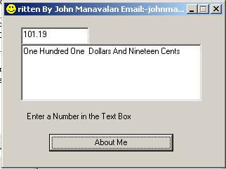



## Convert a number to a string words like 19\.50 to "Nineteen Dollars And Fifty Cents "

### Description

Hello to all PSC users. I have updated My submission now it can Convert a number to a string words up to 999 billion in American format And also up to 99 Crore in Indian Format. Thanks for sending Me your comments And Suggestions to Me. You can use it where ever you like. You have all the right for updating this or uploading it to any other server other than PSC. A mention of My name in the code which you use or update or upload will be greatly appreciated. This code is free for all. I don’t request you to vote for Me. Please don’t vote for any one without knowing about the code. If you Like this code then vote for Me. With Love And Prayer John Manavalan Web Site: www.Manavalan.com Email: johnmanavalan@hotmail.com Call Me : +91 9447002517 ( Send Me TXT Msg )
 
### More Info
 

             |
---                |---
**Submitted On**   |2003-03-09 11:09:20
**By**             |[John Manavalan](https://github.com/Planet-Source-Code/PSCIndex/blob/master/ByAuthor/john-manavalan.md)
**Level**          |Intermediate
**User Rating**    |4.8 (19 globes from 4 users)
**Compatibility**  |VB 3\.0, VB 4\.0 \(16\-bit\), VB 4\.0 \(32\-bit\), VB 5\.0, VB 6\.0, VB Script, ASP \(Active Server Pages\) , VBA MS Access, VBA MS Excel
**Category**       |[Miscellaneous](https://github.com/Planet-Source-Code/PSCIndex/blob/master/ByCategory/miscellaneous__1-1.md)
**World**          |[Visual Basic](https://github.com/Planet-Source-Code/PSCIndex/blob/master/ByWorld/visual-basic.md)
**Archive File**   |[Convert\_a\_155716392003\.zip](https://github.com/Planet-Source-Code/john-manavalan-convert-a-number-to-a-string-words-like-19-50-to-nineteen-dollars-and-fifty__1-43886/archive/master.zip)

